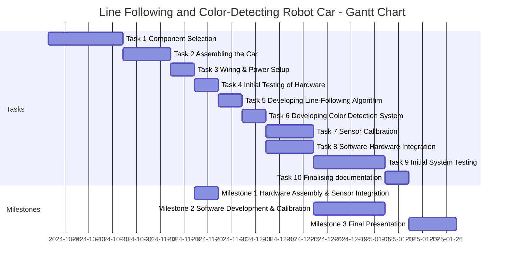

#  Line Following and Color-Detecting Robot Car 

## Tasks
 - Task 1: Component Selection
 - Task 2: Assembling the Car
 - Task 3: Wiring & Power Setup
 - Task 4: Initial Testing of Hardware
 - Task 5: Developing Line-Following Algorithm
 - Task 6: Developing Color Detection System
 - Task 7: Sensor Calibration
 - Task 8: Software-Hardware Integration
 - Task 9: Initial System Testing
 - Task 10: Finalising documentation

## Milestones
### **SMART Milestone 1: Hardware Assembly & Sensor Integration**

- **Specific**: Assemble the robotic car, including motor control, infrared sensors, and color sensors, ensuring that all hardware components are physically connected and integrated with the Raspberry Pi. Initial testing will verify if the robot can respond to motor control and sensor inputs.
  
- **Measurable**: Complete assembly and verify that the motors respond to control signals and all sensors provide readings. Success criteria will be based on:
  - Motors run when commanded (100% functionality).
  - Sensors detect at least 3 types of color and infrared input (90% accuracy in basic tests).
  
- **Achievable**: Team Member 1 and 3 (Maciej and Bartosz) have experience with hardware assembly and sensor integration, making this task feasible with the available tools and components.

- **Relevant**: This milestone is crucial because a fully assembled and functioning robot is the foundation for software development and testing.

- **Time-bound**: Start on **October 23, 2024**, and finish by **November 20th, 2024**.

---

### **SMART Milestone 2: Software Development & Calibration**

- **Specific**: Develop and integrate software for line-following and color detection using Raspberry Pi, infrared sensors, and color sensors. Ensure the robot can follow a line and respond to color changes on the path. Calibrate the sensors for various lighting conditions and surface types.

- **Measurable**: The system will be tested on predefined tracks with target accuracy and response time:
  - 95% accuracy in detecting red, blue, and green colors under standard lighting conditions.
  - Line-following with 90% path adherence, ensuring smooth motion without deviation.
  - Color response time under 500 milliseconds.

- **Achievable**: The team has the necessary skills for coding (Team Member 2 - Matio) and testing (Team Member 3 - Bartosz), ensuring the task is realistic within the time limit.

- **Relevant**: This milestone ensures the core functionality of the robot—line following and dynamic reaction to surface colors—directly aligning with the project goals.

- **Time-bound**: Start on **November 20th, 2024**, and finish by **Jannuary 8th, 2025**.

---

### **SMART Milestone: Final Presentation**

- **Specific**: Deliver a comprehensive final presentation showcasing the fully functional Line Following and Color-Detecting Robot Car. The presentation will include a live demonstration of the robot, covering its ability to follow a line and respond to color changes, as well as an explanation of the hardware, software, challenges, and learnings from the project.

- **Measurable**: The presentation will be assessed on:
  - A **live demo** showing the robot achieving 95% color detection accuracy and responding to line-following paths with at least 90% path adherence.
  - A clear breakdown of the **hardware and software components**, explaining sensor integration, motor control, and software algorithms.
  - Addressing **at least 2 challenges** encountered during the project and presenting their respective solutions.

- **Achievable**: The team has developed all components of the robot, and testing prior to the presentation will ensure that the demonstration will run smoothly. 

- **Relevant**: The final presentation is the culmination of the project, directly showcasing the results of the team's work. It will demonstrate the real-world application of the line-following and color-detecting capabilities, making it a key step in proving project success.

- **Time-bound**: The presentation will be delivered by **January 29th, 2025**, with the demonstration and presentation documents prepared for review.

 ## Gantt chart

